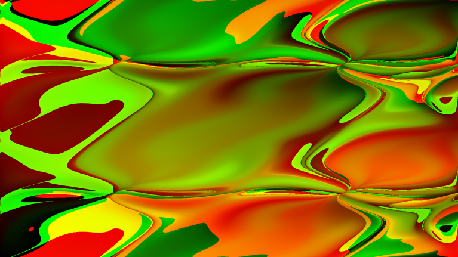
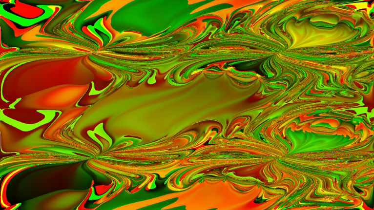
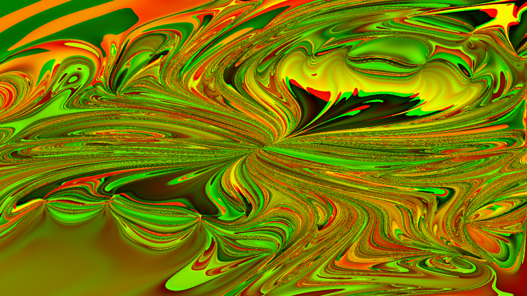

# Simple Solvers for differential equations

## Whats this

This is a simple test i wrote in preparation for the exam of "Modellbildung und Simulation" at TUM.
It implements solvers for the differential equations of heat dissipation and double pendulum using
the graphic card for accelerated computation.

You can view the results here:
* [Heat dissipation](./heat.html)
* [Double pendulum](./pendel.html)

## Double pendulum

The implementation for the double pendulum simulates many pendulums at the same time.
Every pixel is a single double pendulum, where the initial angle of the two pendulums
depends on the x and y axis.
In the beginning this looks pretty boring:

After a few seconds it already becomes pretty interesting:

And after a while it looks pretty crazy:

There are more pictures in the [picture folder](./img/), but why dont you just go ahead and play with [it](./pendel.html) yourself?

## Technichal notes

I implemented this using [regl](https://github.com/regl-project/regl), wich is a pretty cool framework
to implement shaders in WebGL and makes it pretty easy!

The implementation uses the [euler method](https://en.wikipedia.org/wiki/Euler_method) for solving the differential
equations for a [double pendulum](https://en.wikipedia.org/wiki/Double_pendulum#Lagrangian).
It is easy to implement and doesnt require a lot of computations but is not the best method for solving differential
equations. If I find the time I might try the runge-kutta method to see if it improves the result.